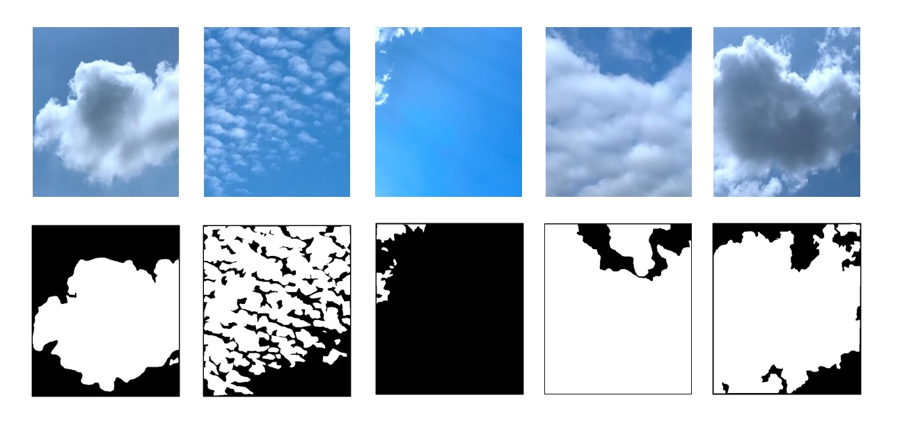

# TJNU-Cloud-Detection-Database
An open source provided for ground-cloud related researchers to promote research.
TJNU Cloud Detection Database (TCDD) is collected from 2019 to 2020 in nine provinces of China, which includes Tianjin, Anhui, Sichuan, Gansu, Shandong, Hebei, Liaoning, Jiangsu, and Hainan. It contains 2300 ground-based cloud images and their corresponding cloud masks. The TCDD is composed of 1874 training images and 426 test images. The cloud images are captured by visual sensors and stored in the PNG format with the pixel resolution of 512×512.  All the images are cooperatively annotated by the meteorologists and the cloud-related researchers from College of Electronic and Communication Engineering, Tianjin Normal University, Tianjin, China, and Meteorological Observation Centre, China Meteorological Administration, Beijing, China. The TCDD will be provided free of charge to cloud-related researchers in order to promote research. Hereunder, some ground-based cloud images and their cloud masks are presented.

# If you use this dataset in your research, please kindly cite our work as,

@article{zhang2022ground,  
  title = {Ground-based Cloud Detection using Multiscale Attention Convolutional Neural Network},    
  author = {Zhang, Zhong and Yang, Shuzhen and Liu, Shuang and Xiao, Baihua and Cao, Xiaozhong.},  
  journal = {IEEE Geoscience and Remote Sensing Letters},   
  volume = {19},  
  pages = {1--5},  
  year = {2022},  
  publisher = {IEEE}   
}

# Download
Please download, fill and sign the [TCDD Agreement](https://github.com/zhongzhang8848/TJNU-Cloud-Detection-Database/blob/main/TCDD%20Agreement.pdf) and return the whole document to zhong.zhang8848@gmail.com or zhangz@tjnu.edu.cn. The downloaded URL and password will be contained in the replied email.
